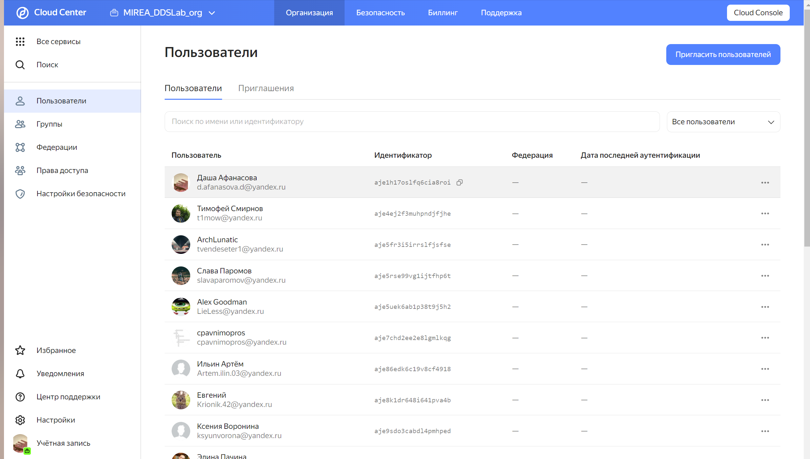
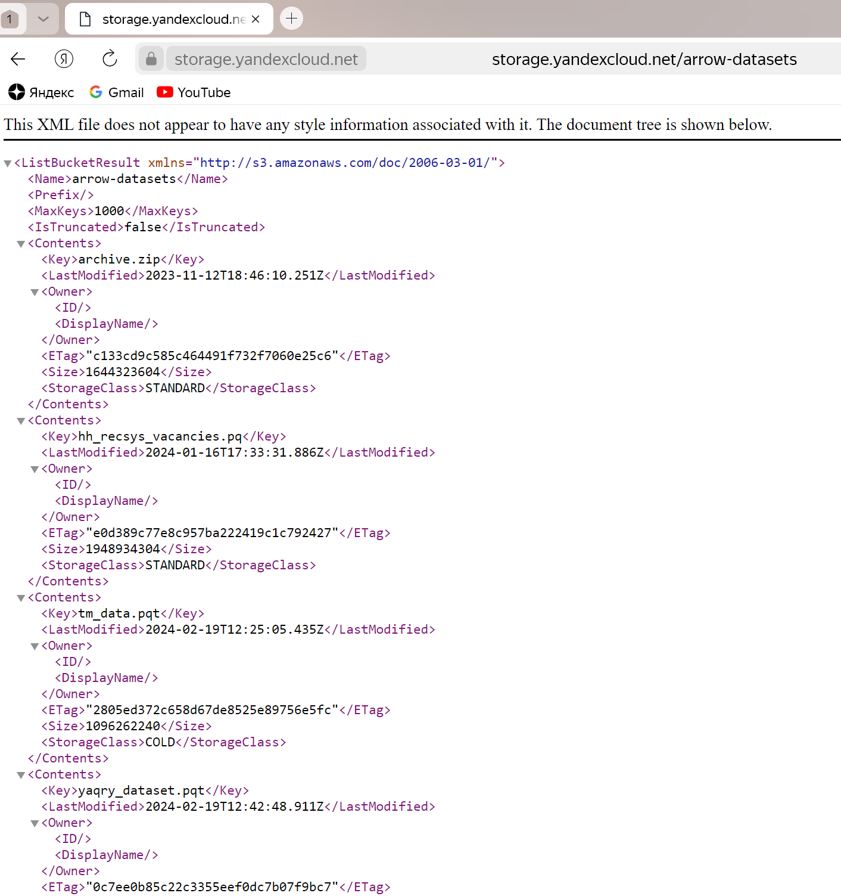
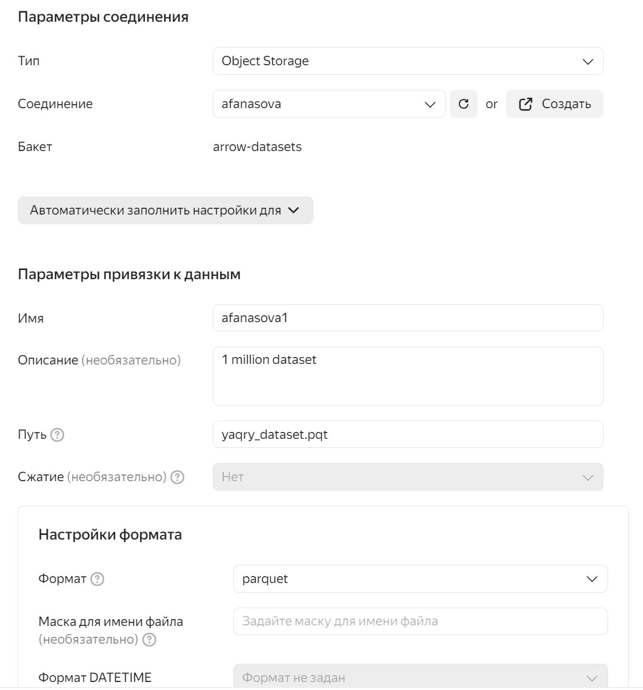
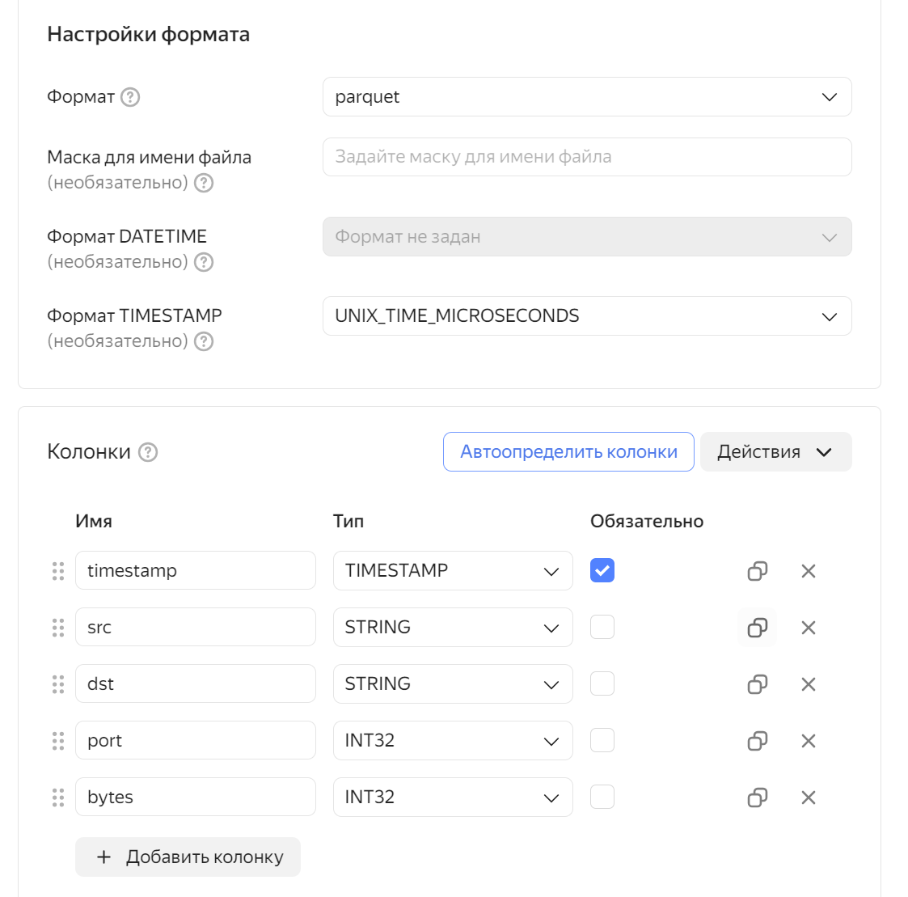
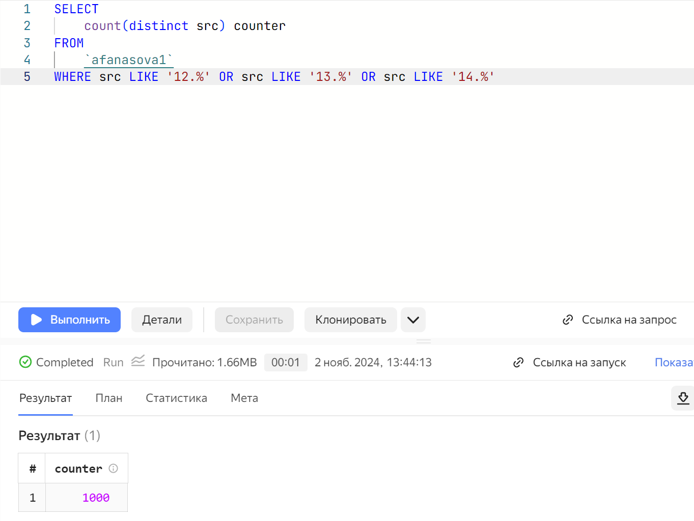
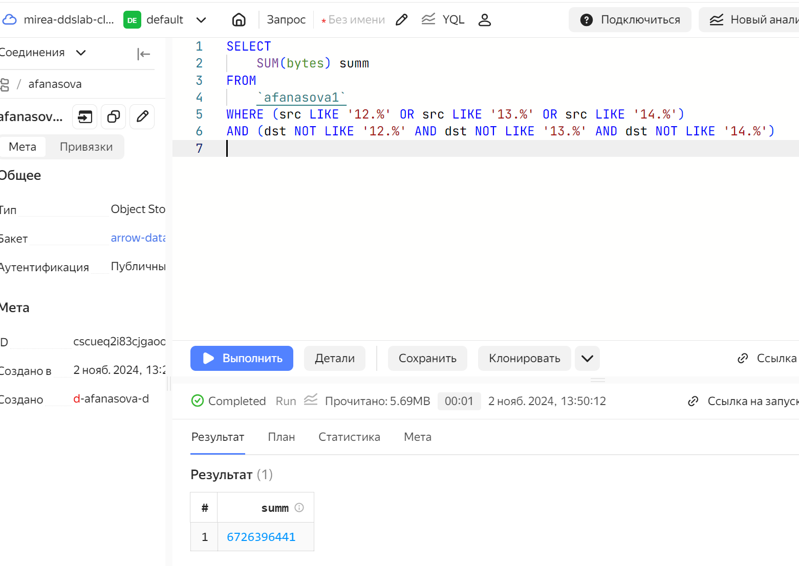
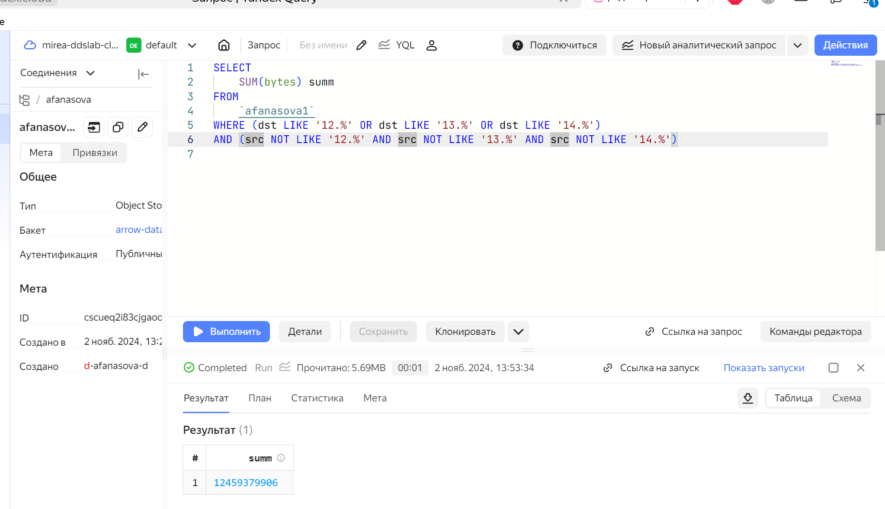

# Цель работы

1.  Изучить возможности технологии yandex Query для анализа структурированных наборов данных
2.  получить навыки построения аналитического пайплайна для анализа данных с помощью сервисов Yandex Cloud
3.  Закрепить практические навыки использования SQL для анализа данных сетевой активности в сегментированной корпоративной сети

# План

1.  Проверить доступность данных в бакете
2.  Подсоединенный к Yandex Cloud Organization аккаунт
3.  Бакет arrow-datasets

# Шаги

1.  Принимаем приглашение с почты



2.  Проверяем доступность данных с помощью сконструированного URL.



3.  Создаем соединение для бакета и заполняем поля данными


4.  Настроим привязку данных

 

5.  Выполняем аналитический запрос и смотрим результат


# Анализ

Решите следующие задачи: 1. Известно, что IP-адреса внутренней сети начинаются с октетов, принадлежащих интервалу \[12-14\]. Определите количество хостов внутренней сети, представленных в датасете.



2.  Определите объем исходящего трафика



3.  Определите суммарный объем входящего трафика



# Оценка результата

В результате выполненной работы было установлено собственное соединение с датасетом и выполнены все задания

# Вывод

После выполненной работы были улучшены навыки написания SQL-запросов, а также был проанализирован датасет исходящего и входящего трафиков.

```{r}
1
```
