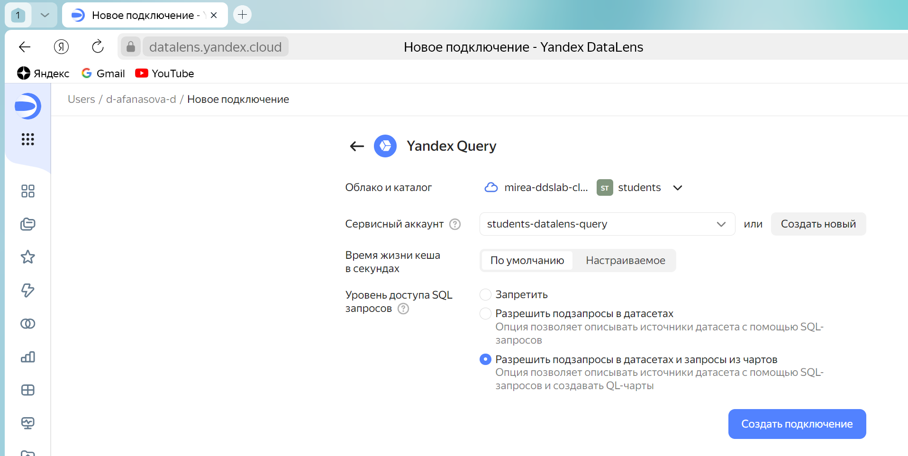
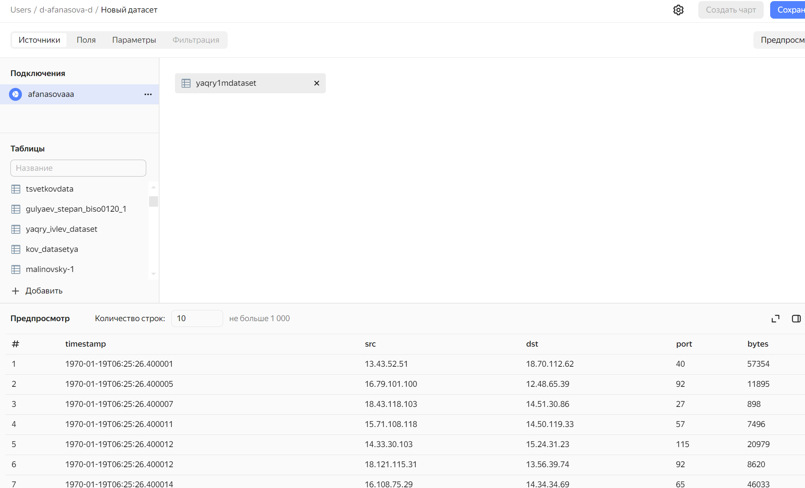
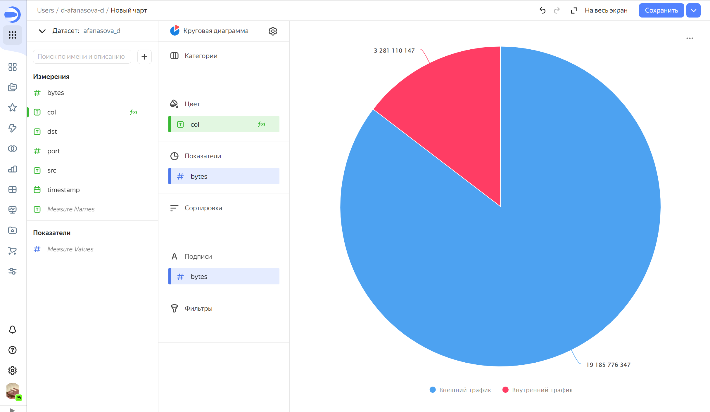
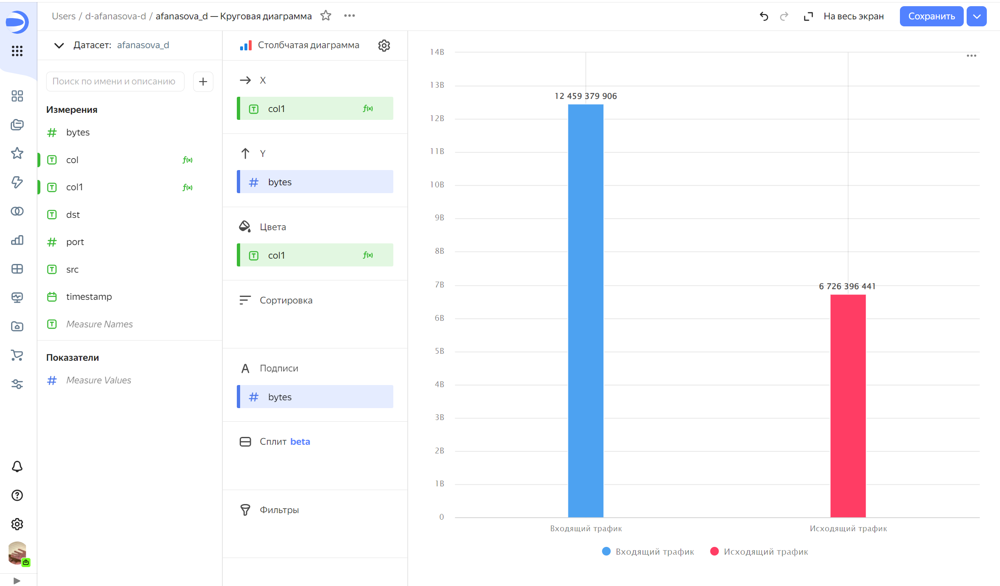
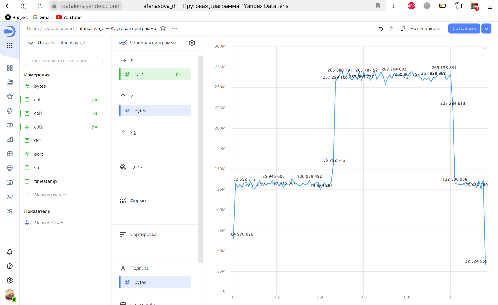
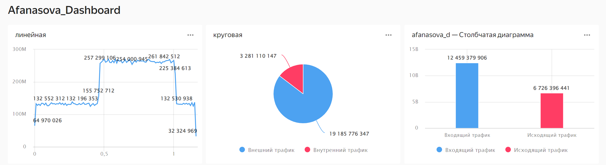

# Использование технологии Yandex Query DataLens для анализа данных сетевой активности

## Цель работы

1.  Изучить возможности технологии Yandex Query для визуального анализа структурированных наборов данных
2.  Получить навыки визуализации данных для последующего анализа с помощью сервисов Yandex Cloud
3.  Получить навыки создания решений мониторинга/SIEM на базе облачных продуктов и открытых программных решений
4.  Закрепить практические навыки использования SQL для анализа данных сетевой активности в сегментированной корпоративной сети

## Исходные данные

1.  Программное обеспечение MacOS 14.4.1 Sonoma
2.  Подсоединенный к Yandex Cloud Organization аккаунт

## План

1.  Представить в виде круговой диаграммы соотношение внешнего и внутреннего сетевого трафика.
2.  Представить в виде столбчатой диаграммы соотношение входящего и исходящего трафика из внутреннего сетвого сегмента.
3.  Построить график активности (линейная диаграмма) объема трафика во времени.
4.  Все построенные графики вывести в виде единого дашборда в Yandex DataLens.

## Шаги

1.  Настраиваем подключение к YandexQuery из DataLens



2.  Создаем датасет со своим именем с таблицей yaqry2dataset



3.  Создаем чарты и оформляем их в соответствии с заданием: а) Представить в виде круговой диаграммы соотношение внешнего и внутреннего сетевого трафика.

Функция для col:
```{r}
IF (([dst] LIKE '12.%' OR [dst] LIKE '13.%' OR [dst] LIKE '14.%') AND ([src] LIKE '12.%' OR [src] LIKE '13.%' OR [src] LIKE '14.%')) THEN "Внутренний трафик" ELSE "Внешний трафик" END
```



b)  Представить в виде столбчатой диаграммы соотношение входящего и исходящего трафика из внутреннего сетвого сегмента.

Функция для col1:
```{r}
IF (([src] LIKE '12.%' OR [src] LIKE '13.%' OR [src] LIKE '14.%') AND (NOT([dst] LIKE '12.%' OR [dst] LIKE '13.%' OR [dst] LIKE '14.%'))) THEN "Исходящий трафик" ELSEIF (([dst] LIKE '12.%' OR [dst] LIKE '13.%' OR [dst] LIKE '14.%') AND (NOT([src] LIKE '12.%' OR [src] LIKE '13.%' OR [src] LIKE '14.%'))) THEN "Входящий трафик" END
```



c)  Построить график активности (линейная диаграмма) объема трафика во времени.
Функция для col2:
```{r}
ROUND(([timestamp] - DATETRUNC([timestamp], "second")) * 100000,2)
```

 

4. Спроектировать дашборд в соответствие с моим видением и фантазией.



## Оценка результата

В результате работы были созданы чарты и из них создан прекрасный дашборд.

## Вывод

Были изучены и выучены методы работы с данными в Yandex Datalens. Были созданы чарты и дашборды.
